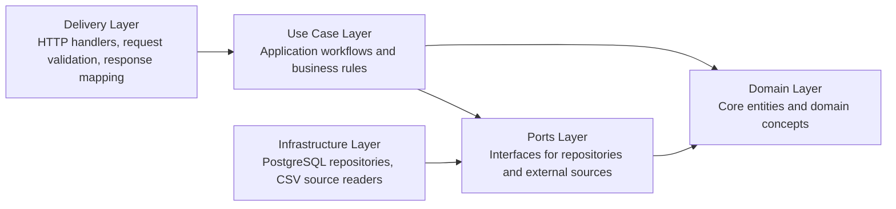
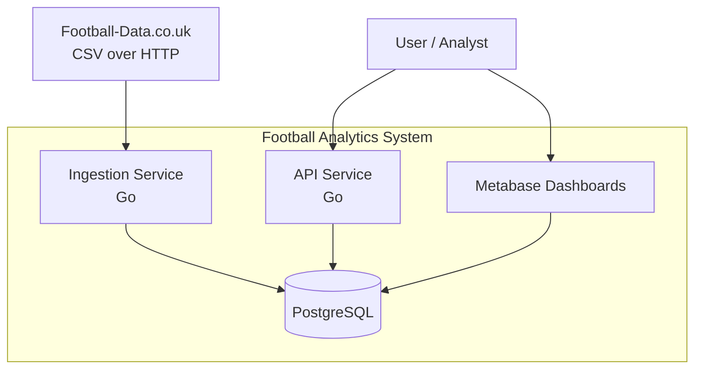

# System Architecture

## Overview

The Football Analytics System is a backend platform designed to ingest, store and analyze football match statistics.

The system is designed with the following goals:

- reliable ingestion pipeline
- clear separation of responsibilities
- reproducible infrastructure
- extensibility for future analytics features

The architecture follows a **pragmatic Clean Architecture approach**, prioritizing maintainability and clear dependency rules over unnecessary abstraction.

---

## Architectural View

The system can be understood through two complementary perspectives:

1. **Container-level view** of the platform as a whole
2. **Internal layering view** of the backend application

The container-level view belongs in the README.  
This document focuses mainly on the **internal backend architecture**.

---

## Architectural Layers

The backend is organized into five logical layers:

- Delivery
- Use Case
- Ports
- Domain
- Infrastructure

Dependencies must always point **toward the core domain and abstractions**.

---

## Internal Layering



This diagram illustrates the dependency direction between layers.

Infrastructure implements interfaces defined by the ports layer, while business logic remains isolated in the use case and domain layers.

---

## Layer Responsibilities

### Domain Layer

**Location:** `internal/domain`

Contains core business entities and domain concepts.

Examples:

- Match
- Team
- Competition
- Season
- IngestionRun

Rules:

- no database dependencies
- no HTTP dependencies
- no framework dependencies
- minimal domain logic only
- must represent the business language of the system

The domain layer must remain stable and independent from technical implementation details.

---

### Use Case Layer

**Location:** `internal/usecase`

Contains application workflows and business logic.

Examples:

- ingest season data
- compute team statistics
- retrieve season summaries
- calculate over/under metrics

Responsibilities:

- orchestrate domain entities
- call repository and source interfaces
- enforce business rules
- coordinate application workflows

Rules:

- depends on `domain` and `ports`
- must not depend on infrastructure implementations
- must not depend on delivery code

---

### Ports Layer

**Location:** `internal/ports`

Defines interfaces used by the use cases.

Examples:

- MatchRepository
- TeamRepository
- CompetitionRepository
- IngestionRunRepository
- SourceReader

Ports decouple the application logic from technical implementations.

Infrastructure components implement these interfaces.

Rules:

- contracts only
- no business logic
- no concrete infrastructure concerns

---

### Infrastructure Layer

**Location:** `internal/infra`

Contains technical implementations.

Examples:

- `internal/infra/postgres`
- `internal/infra/sources`

Responsibilities:

- PostgreSQL repositories
- HTTP CSV ingestion
- external system adapters
- parsing and technical transformations

Infrastructure must implement interfaces defined in the ports layer and must not contain business rules.

Rules:

- may depend on third-party libraries
- may contain SQL
- may contain HTTP calls
- must not orchestrate business workflows

---

### Delivery Layer

**Location:** `internal/delivery`

Responsible for input and output of the system.

Examples:

- HTTP API handlers
- request validation
- response formatting
- DTO mapping

Rules:

- no business logic
- no direct database access
- must call use cases only

The delivery layer should remain thin and transport-focused.

---

## Dependency Rules

### Allowed dependency direction

```text
delivery -> usecase -> ports <- infra
usecase -> domain
ports -> domain
infra -> domain
```

### Forbidden dependencies

```text
domain -> infra
domain -> delivery
usecase -> infra
usecase -> delivery
ports -> infra
ports -> delivery
delivery -> database directly
```

Violating these rules introduces coupling that breaks the architecture and makes the system harder to test and evolve.

---

## Container Context

At the platform level, the system is composed of the following main containers/services:

- **API Service (Go)** for analytics endpoints
- **Ingestion Service (Go)** for loading match data
- **PostgreSQL** for persistent storage
- **Metabase** for dashboards and exploratory analysis
- **External CSV Source** for structured football match data

The recommended high-level container diagram for the README is:



This diagram represents the system at a container level, not the internal layering of the Go application.

---

## Data Flow

### 1. Data Ingestion

External match data is retrieved from structured CSV sources.

```text
CSV source
   ↓
HTTP CSV Reader
   ↓
Ingestion Use Case
   ↓
Repository
   ↓
PostgreSQL
```

The ingestion process must be **idempotent**, allowing safe reprocessing of historical data.

Key requirements of this flow:

- stable structured input
- normalization of competition, season and team data
- safe upserts
- ingestion audit tracking

---

### 2. Analytics Queries

The API exposes analytics queries that operate on the stored dataset.

```text
HTTP API
   ↓
Query Use Cases
   ↓
Repositories
   ↓
PostgreSQL
```

These queries compute aggregated statistics such as:

- team performance
- goals for and against
- over/under metrics
- seasonal comparisons
- form over the latest N matches

---

### 3. Visualization

Analytics results can be visualized using Metabase dashboards.

```text
PostgreSQL
   ↓
Metabase
```

Metabase connects directly to the database to allow exploration and dashboard creation without requiring additional backend rendering logic.

---

## Repository Mapping

The architectural layers map to the repository as follows:

```text
cmd/
  api/
  ingester/

internal/
  domain/
  usecase/
  ports/
  infra/
    postgres/
    sources/
  delivery/
    http/

migrations/
deploy/
docs/
specs/
checklists/
```

### Notes

- `cmd/` contains composition roots and application entry points
- `internal/domain/` contains the business core
- `internal/usecase/` contains application workflows
- `internal/ports/` contains interfaces
- `internal/infra/` contains adapters and implementations
- `internal/delivery/http/` contains the API transport layer
- `migrations/` contains database evolution scripts
- `deploy/` contains Docker Compose and operational files

---

## Infrastructure Environment

The system runs locally using Docker Compose.

Initial services include:

- PostgreSQL
- Metabase

Future deployments may include:

- API container
- ingestion worker container

The local environment should be reproducible and environment-driven.

---

## Architectural Philosophy

The system follows several guiding principles:

- **Architecture before framework**
- **Interfaces over implementations**
- **Incremental development**
- **Spec-driven implementation**
- **Stability before sophistication**
- **Idempotency as a core ingestion concern**

The goal is to maintain a backend that is:

- easy to reason about
- easy to extend
- easy to test
- resilient to infrastructure and source changes

---

## Related Documentation

For more details, see:

- `README.md`
- `PROJECT_MAP.md`
- `docs/system-overview.md`
- `docs/architecture-rules.md`
- `docs/coding-rules.md`
- `docs/development-workflow.md`
- `docs/ai-development-guide.md`

---

## Final Rule

If a change does not clearly fit this architecture, the change must be reconsidered before implementation.

Unclear placement usually means unclear design.
